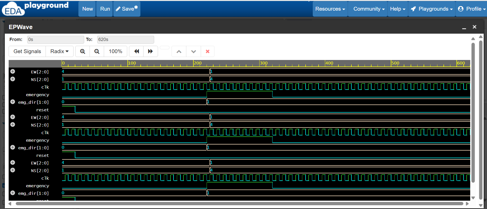

.>> FPGA-Based Traffic Light Controller with Priority System

This project implements a traffic light controller using Verilog HDL.
The design is based on a Finite State Machine (FSM) and includes an
emergency vehicle priority override mechanism.

--> Features
- FSM-based traffic light control
- Emergency vehicle priority override
- Separate North–South and East–West signaling
- Fully synthesizable Verilog design

--> Simulation & Verification
The functionality was verified through RTL simulation using an
industry-standard Verilog simulator (Icarus Verilog on EDA Playground).
Waveforms were analyzed to confirm correct emergency priority behavior.

--> Emergency Scenario Verification
When the emergency signal is asserted, the controller immediately
forces GREEN for the selected direction while keeping all other
directions RED.

--> Simulation Waveform

--> Tools Used
- Verilog HDL
- VS Code
- EDA Playground (Icarus Verilog + EPWave)

--> Implementation Details
The controller is implemented using synthesizable Verilog HDL and follows
an FSM-based architecture. The design is suitable for deployment on
Xilinx Spartan-class FPGA boards.

--> Author
Bishal Dey
